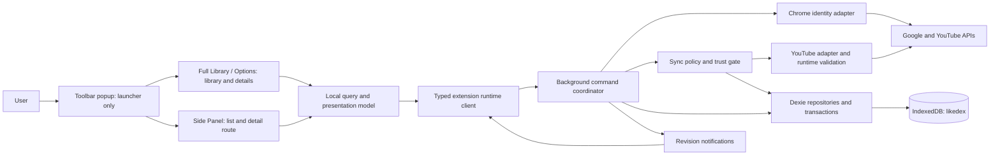
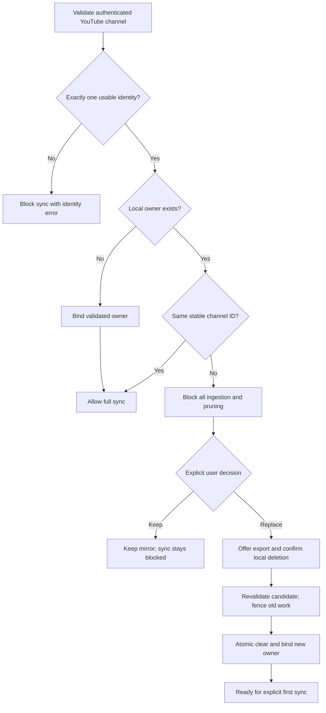
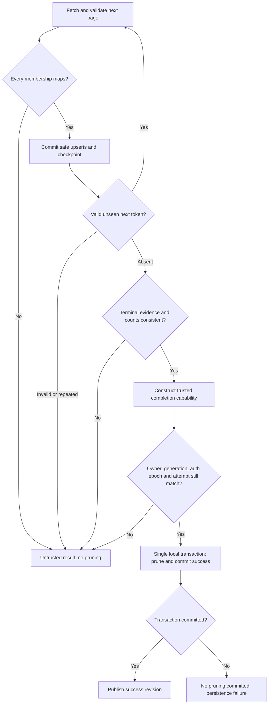
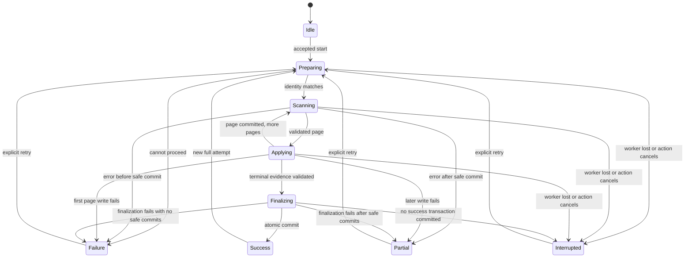

# Likedex engineering specification

Status: proposed implementation contracts, 2026-10-04. No implementation exists. The human-approved B-01 resolution is incorporated throughout: revoke/delete, bounded freshness and external-revocation cleanup are required. See [privacy and data](release/privacy-and-data.md#b-01-resolved-human-decision). B-01 is resolved; mechanisms below can be refined with evidence without weakening the approved postconditions.

## System and boundaries

Use WXT, Chrome Manifest V3, React, strict TypeScript, Dexie/IndexedDB, Zod, Vitest, Playwright, and npm. Pin compatible versions at implementation time. No backend or generic playlist layer. Package/project/database identifier is `likedex`; environment names start with `LIKEDEX_`.

Auth owns token acquisition/cache invalidation/revocation. Provider owns HTTP, schemas, error classification, and mapping. Domain/sync owns state transitions and permission to prune. Storage owns atomic reads/writes and fencing. Runtime owns validation, acknowledgements, and state observation. Query logic transforms local snapshots; UI owns interaction and accessibility. Only the background coordinator writes durable domain data; neither UI nor provider can delete membership directly.

## Durable data model

All instants are UTC ISO-8601; counters are nonnegative integers. Unknown values use explicit null or tagged unknown states, never invented defaults. Data schema version starts at integer 1, independently from release version `0.1.0`.

| Entity/store | Required fields and meaning |
|---|---|
| Control singleton | `dataGeneration`, monotonically increasing `revision`, `connectionGate` (disconnected/connected), `authEpoch`, independent revocation/cache-invalidation/deletion statuses, pending cleanup reason (disconnect/authorization-invalid/authorization-unverified/expiry), nonsecret authorization-check deadline. No token, remote ID/count/title/profile here. Generation/epoch fence stale work; minimal cleanup intent survives dataset deletion. |
| Owner singleton | `channelId`, `likesPlaylistId`, optional display name, `verifiedAt`. One owner or null. Stable channel ID is identity; display name and Chrome email are not. |
| MirroredVideo, keyed by video ID | `videoId`, owner channel ID, membership source playlist-item IDs, `lastSeenAttemptId`, nullable title/channel ID/channel name/description/thumbnail URL/likedAt/publishedAt/durationSeconds, availability (available/unavailable/unknown) and evidence, `membershipObservedAt`, `metadataFetchedAt` when applicable. |
| Sync singleton | `currentAttempt` or null; `previousCompletedResult` or null; `latestSuccessfulSync` or null; last mirror-change revision and last finalized mirror revision for snapshot provenance. Bounded records, not a history store. |
| Attempt | UUID, request ID, owner if established, generation/auth epoch, worker instance ID, state, startedAt/updatedAt/finishedAt, pages accepted, raw items, unique membership count, safe commits, retry indicator, nullable estimated total, sanitized error, nullable completion evidence. |
| Latest successful sync | Attempt/owner/generation IDs, startedAt/completedAt, page count, raw/unique remote counts, local membership/available counts, add/update/remove counts. Preserved through ordinary sync failure while eligible; replaced on success or removed with any authorized dataset cleanup. |
| Library preferences | Optional future persisted library UI choices only. Initial design keeps query, filters, sort, page, selection, expansion, scroll, route, popovers in surface memory. |
| Freshness provenance on all Authorized Data | Actual validation/fetch time and expiry for owner, membership, metadata fields/groups and derived sync/attempt data; dataset deadline is the minimum of its retained data deadlines. No generic write/read/Connect timestamp can refresh API data. |

Do not store raw provider bodies, tokens, authorization headers, browser identity internals, or an unbounded attempt log. Store a sanitized error category, safe message key, phase, and optional HTTP/provider reason allowlist. Latest success describes that successful snapshot even if later safe updates alter the current mirror.

`previousCompletedResult` is the most recent terminal attempt before the current attempt. When a new attempt starts, rotate the preceding terminal currentAttempt into this slot. Ordinary sync failure does not change latestSuccessfulSync while the dataset remains eligible. Cleanup deletes all associated attempt/success data, and a separate data-free reason explains its removal; never mislabel this as successful empty reconciliation. “Never synced” is not inferred from an RPC failure.

## Auth and authoritative ownership

Request only `https://www.googleapis.com/auth/youtube.readonly`. Use `chrome.identity.getAuthToken`; interactive acquisition occurs only after Connect. Cached/noninteractive access is allowed only while the durable connection gate permits it. A 401 may evict the exact cached token and reacquire noninteractively once; if authorization cannot then be validated/refreshed, close the gate and delete associated Authorized Data. Revalidate channel identity after reacquisition before accepting more pages. Never persist tokens in app storage or return them to UI/export/logs. Chrome manages its own cache. The [identity API](https://developer.chrome.com/docs/extensions/reference/api/identity) documents acquisition and cache invalidation; cache removal alone does not prove remote revocation.

Resolve `channels.list(mine=true, part=id,snippet,contentDetails)` and validate the authenticated channel ID plus its `contentDetails.relatedPlaylists.likes`. Do not synthesize the likes playlist ID. Zero channels, more than one unresolved channel, missing likes playlist, or malformed identity must block sync with actionable error. Do not silently choose the first channel. These fields are documented in [channels.list](https://developers.google.com/youtube/v3/docs/channels/list) and the [channel resource](https://developers.google.com/youtube/v3/docs/channels).

Phase 3 owns this validated authenticated bootstrap discovery, including the optional channel title and authoritative Likes playlist identifier, at adapter/service/domain level. Missing or malformed channel/playlist identity returns a typed validation failure. This does not enumerate Liked Videos: `playlistItems.list`, playlist pagination and `videos.list` library hydration remain Phase 4 ingestion work, with synchronization/reconciliation in Phase 5. Runtime messages/handlers/routing remain Phase 6; product connection/onboarding UI remains Phases 7–8, and complete Disconnect controls remain Phase 9. These phase boundaries do not change the final product behavior below.

At every full attempt, revalidate owner before membership access. At finalization, recheck current auth epoch/generation and revalidate the remote owner before opening the transaction. A missing local owner is bound atomically only after authoritative identity validation. A mismatched owner yields zero page writes and zero pruning. Changing Google profile display data alone is not an ownership transition.

Replacement confirmation is tied to both channel IDs and the current data generation. If either changes while the dialog is open, reject and show updated confirmation. Failure rolls back the local transaction; never blend owners. Mismatch alone cannot authorize merge, replacement or reconciliation pruning; independent expiry/authorization cleanup still applies and must name its separate reason. After Disconnect cleanup no old owner remains to match: Connect establishes a fresh owner. UI can route a user back through explicit Connect to resolve channel selection without providing a multi-account manager.

## Provider requests and validation

Enumerate only the resolved likes playlist with `playlistItems.list(part=id,snippet,contentDetails,status, maxResults=50, playlistId=...)`, following all returned page tokens. Hydrate returned unique video IDs with batched `videos.list(part=snippet,contentDetails,status, id=...)` within documented API batch limits. Only GET requests to YouTube data endpoints are allowed. Auth revocation is a separate Google control operation. See [playlist pagination](https://developers.google.com/youtube/v3/docs/playlistItems/list), [playlist-item fields](https://developers.google.com/youtube/v3/docs/playlistItems), and [video lookup](https://developers.google.com/youtube/v3/docs/videos/list).

Zod or equivalent validates HTTP-success bodies before mapping: correct envelope kind; explicitly present items array; valid nonempty IDs; requested playlist identity; video-resource type; ID agreement across contentDetails/snippet when both supplied; pageInfo nonnegative totals/counts; legal nextPageToken type; required resource containers. Unknown extra properties may be ignored. Missing required containers cannot default to empty. Reject an empty-string token, repeated request/next token, inconsistent playlist/identity, impossible counts, or any membership record without a trustworthy video ID. Preserve opaque token values exactly and never log them.

Parsing distinguishes:

- **Valid:** all membership evidence maps and known metadata passes its schema.
- **Incomplete but safely representable:** membership video ID is trustworthy; optional title/date/channel fields are missing and explicitly unknown.
- **Malformed/untrusted:** required structure or membership mapping fails; no completion proof may be produced.
- **Unavailable metadata:** a valid video lookup omits a requested ID or explicitly reports unavailability. Keep membership, classify metadata unknown/unavailable with its actual evidence. Omission alone does not prove deletion or that the video is unliked.

A malformed metadata payload fails the attempt conservatively; valid omission of optional metadata does not. Validated page membership may already have been persisted safely. A transport failure hydrating metadata ends the attempt after bounded retries, with no pruning. For newly observed membership without hydrated data, store unknown availability; never invent a title or channel. Existing validated metadata may remain marked with its actual timestamp; failed hydration must not overwrite it with fabricated emptiness.

`likedAt` comes only from a validated playlist item's addition time (`snippet.publishedAt`) when that field is applicable to liked membership; `publishedAt` comes from the video publication field. Preserve timestamp provenance. Do not confuse playlist-owner channel metadata with the video's creator. Parse duration as a finite nonnegative duration; missing/unsupported forms are unknown, not zero. Provider-derived public/unlisted, processed-video metadata can support `available`; explicit private/rejected/deleted evidence supports `unavailable`; remaining cases are unknown. This is API-observed availability, not universal playability (region/age/access restrictions can differ). No trust badges are planned. See [video resource semantics](https://developers.google.com/youtube/v3/docs/videos).

## Trusted complete enumeration and pruning

This gate governs deletion justified as **no longer remotely liked**. Clear, confirmed owner replacement, Disconnect, authorization-invalid/unverified cleanup and freshness expiry are separate local deletion authorities. They must never fabricate trusted enumeration or successful sync. The no-prune invariant cannot be used to retain data past a policy deadline or after authorization cleanup is required.

`TrustedCompleteEnumeration` is an internal domain capability, never a UI boolean. It binds attempt ID, owner ID, playlist ID, generation/auth epoch, accepted page-chain evidence, raw/unique counts, membership set, terminal-page observation, and validator revision. Only the validated enumerator may construct it. A caller-supplied `complete: true`, a successful HTTP status, or loop termination cannot authorize deletion.

All conditions must hold:

1. Authenticated owner matches the local owner throughout the attempt; every page belongs to that likes playlist.
2. Enumeration begins at the first page and follows a single uninterrupted chain of validated tokens. Every page and every membership record is accounted for; no skip, truncation, mapper filtering, or early page limit.
3. A valid terminal response has **no nextPageToken**, and an explicit valid items array (including `[]`). No outstanding fetch, retry, mapping failure, or untrusted warning remains.
4. Present pageInfo totals must be consistent across pages and with raw membership count at completion. A mismatch or missing required pageInfo is untrusted, not an empty result. Count consistency is a conservative extra check, never proof by itself.
5. Duplicate playlist-item ID is an enumeration anomaly and forbids trust. Distinct valid playlist-item IDs for the same video count as raw membership records, deduplicate into one video, and do not by themselves invalidate completeness. Conflicting membership identity is untrusted.
6. Every safe page transaction committed; finalization still owns the active attempt and the same generation/auth epoch. Metadata requests have completed successfully or produced explicitly representable missing metadata.

A valid first terminal page with `items=[]` and `pageInfo.totalResults=0` establishes a trusted empty set and may prune all membership. Missing items, an error body, an unparseable body, or a playlist-not-found response never does.

The API's pagination does not give Likedex a transactional snapshot of changing likes. Trust means complete, internally consistent enumeration of the documented API-visible membership, not proof of an instantaneous or uncapped lifetime library. Visible count/token anomalies fail closed. Recheck real API behavior during the provider slice; any discovered omission/cap or unsupported completeness assumption requires a spec amendment before enabling pruning for affected cases. Do not silently narrow coverage or introduce remote-scale architecture.

## Page transactions and finalization

For each valid page, one Dexie transaction verifies generation/owner/auth epoch/attempt and current eligibility, upserts mapped membership and trustworthy metadata with actual freshness provenance, marks `lastSeenAttemptId`, increments durable counts/checkpoint and revision. It does not remove unrelated membership. Retried requests must not double-apply a page. Pending page/token sets may remain in worker memory; persisted counts are durable truth, not resumable cursors. Partial pages refresh only the facts actually validated; older untouched facts keep their deadlines.

For finalization, perform network operations before opening the transaction. Within one IndexedDB readwrite transaction covering control, owner, videos, and sync metadata: verify fencing and eligibility; record trusted completion evidence; delete records absent from the completed membership set; calculate final counts; mark success; replace latestSuccessfulSync; recalculate freshness deadlines; increment revision. Success refreshes relevant validated data, not omitted/stale metadata or historical evidence by association. No external await/network request inside the transaction. Publish success only after commit. Abort rolls back pruning and success metadata together; earlier safe page commits remain only while eligible.

Crash after commit but before notification is still success on next read. Crash before/during an uncommitted final transaction leaves earlier safe updates and an interrupted attempt. If even failure recording cannot persist, runtime returns a persistence error and UI says status could not be saved; it must not manufacture a durable terminal result. On the next successful initialization, recover stale active truth as interrupted.

## Sync lifecycle and MV3 durability

Idle is the absence of a current attempt, normally first use/after dataset deletion. Cleanup cancels/fences an attempt and removes it with the dataset; retain only the separate data-free cleanup reason/status, not a false successful-sync result. `preparing`, `scanning`, `applying`, `finalizing` are durable active phases. `success`, `partial`, `failure`, `interrupted` are terminal. Failure means no safe page commit this attempt; partial means some safe commits but no successful final reconciliation. Interrupted carries progress regardless of how many pages committed. Persist timestamps and error evidence at transitions. In-memory fetch controllers, timers, page-token sets, and completion capability are ephemeral.

Chrome can terminate a worker and discard globals, so do not rely on memory or a held message port for durable status. On each initialization, run the eligibility/cleanup barrier before exposing data or recovering attempts. If the dataset is still eligible, an active attempt owned by a prior worker instance becomes interrupted; terminal success stays success. Pending cleanup instead resumes deletion and no stale attempt restarts. Retry creates a new attempt and starts at page one; no cursor resumption. No indefinite keepalive loop. See [MV3 lifecycle](https://developer.chrome.com/docs/extensions/develop/concepts/service-workers/lifecycle).

Short local state transitions are serialized by the coordinator, with transactional fencing as the final guard. Never hold the command queue across the whole scan, network requests, consent UI, or retry delays: status reads and Clear/Disconnect must remain serviceable. With the human-approved production provider validation gate enabled (or explicitly enabled in injected test composition), two Sync starts atomically claim at most one active slot; the loser receives the existing attempt. Start validates request/local connected state and persists preparing before acknowledgement, without awaiting OAuth refresh, channel fetch, or remote scan. In a controlled integration fixture, acknowledgement must arrive before any held provider promise resolves and within 1 second excluding browser startup; production cold starts have no guaranteed wall-clock SLA. Failed durable claim returns typed failure, never an invented attempt ID.

The [human-approved live-provider gate](synchronization.md#production-live-provider-validation-gate) defaults closed in production until successful live evidence and explicit human approval are recorded. A valid `SYNC START` then returns typed `provider-validation-required` before invoking sync or any request-induced storage mutation: no attempt, ingestion, owner/video change, synchronization freshness refresh, finalization or pruning. Missing/malformed configuration and automated fixtures cannot open it. Independently triggered startup/retention/authorization cleanup and explicit data controls remain required; the rejected request itself performs no bookkeeping write. Phase 6 can implement and deterministically test runtime integration under this restriction. Live observation, evidence, human approval, deliberate enablement, full verification and real-account smoke must precede Store release; provider/finalizer trust invariants remain unchanged.

The startup/control barrier performs local expiry and pending-cleanup work first. Remote authorization validation can run asynchronously during preparing after a prompt start acknowledgement; no Authorized Data is exposed or ingested until it succeeds. While validation is pending, status responses expose only data-free attempt identity/phase and validation/cleanup status, not cached YouTube owner/count metadata. Thus the eligibility gate does not turn Sync start into a remote-blocking call.

## Runtime and surface coordination

### Handoff C.1 library-control contract, 2026-10-07

This is the current contract and supersedes Handoff C's immediate filtering, nested channel expansion, native single-select menus, value-count badge and removal of Reset.

Filter library opens a single fixed-width, bounded working surface immediately. Direct Channels heading/All channels or N selected summary, labeled local search and native checkbox rows use a fixed internal scrolling list; the body scrolls separately from reachable footer actions. No nested channel trigger or expansion remains. Each opening copies committed channels/dateBasis/from/to into an ephemeral draft. Searching, checking channels and editing dates leave committed result count, rows, page, chips, badge, selection and detail unchanged. Apply filters validates and commits all four fields in one query update, resets page 1 and closes. Escape, outside dismissal or closing the trigger discards; reopening copies current committed values. Invalid/reversed dates show the accessible inline error and disable Apply.

Clear (accessible name Clear channels) edits only draft channels. Panel Clear filters restores draft channels/dateBasis/from/to to INITIAL_QUERY, preserving separate main search, Duration and Sort. The stable Filter library trigger reserves indicator space and counts committed active groups: selected channels = 1, date range = 1 (maximum 2). Channel summary counts selected IDs; stable-ID OR and [] = all, local search/hidden selections, title/fallback labels and exact-ID collision disambiguation remain unchanged. Committed chips can still be removed immediately outside the panel.

Dependency-free SingleSelect supplies Duration, Sort and Date basis with a button and themed listbox/options, one existing chevron, selected aria-selected/check/tint, neutral hover and cyan outlined keyboard active state. Opening activates the current selection; arrows/Home/End navigate, Enter/Space select/close/restore focus, Escape dismisses/restores, Tab exits without trapping, and outside clicks dismiss. Native manual popovers enter the top layer without reflow, remain viewport-contained and at least trigger width. Toolbar ownership allows one sibling floating control; the nested Date basis menu preserves the draft and geometry. First Escape closes Date basis, second cancels Filter library. Native date inputs remain.

One resetView path resets the complete LibraryQuery, page 1, selected video, detail route, notice, scroll, draft search and open popovers. Secondary Reset view (title: Reset search, filters, sort and current view) remains reachable on narrow toolbars and focused detail routes; disabled at the initial view without selection. It changes no mirror, account, authorization, privacy agreement, Sync metadata or outside preferences. Eligibility/unavailability removes draft controls and stale channel data; generation/auth-epoch barriers remain authoritative. Pure query/DST/unknown/tie rules, Handoff A/B, provider/auth/storage/sync/network/permissions and dependencies are unchanged.

### Historical Handoff C library-control contract, 2026-10-06 (superseded by C.1)

Keep the pure query engine unchanged. `SelectControl` wraps native single selects (Duration, Sort, Date basis), suppresses the native arrow with `appearance: none`, reserves text padding and overlays one pointer-inert existing SVG down icon. All three use a 16px icon, 14px right inset and structural vertical centering. Disclosures retain native details/summary and the same icon geometry/stroke; their dismissal behavior remains unchanged.

`ChannelMultiSelect` uses a labeled native button, expanded state/controlled group, a labeled local search input and native checkbox rows. It has no combobox/listbox role or active-descendant emulation. Options derive only from the current eligible snapshot's available videos; deterministic representative titles and stable-ID option ordering are retained. Names are primary; normalized colliding names (including multiple missing-name fallbacks) receive exact-ID secondary text. Chips use names/fallbacks and exceptional disambiguation too. Picker search normalizes title/ID text locally, affects neither query search nor pagination and preserves filtered-out selections. Multi-selection uses IDs and leaves the picker open. Clear selection sets `channels: []` and focuses picker search.

The popup expands inside the outer scrollable filter surface, with a bounded internally scrolling option list, avoiding a nested overlay and fixed desktop popup width. Filter library opts into `Disclosure` viewport-height measurement on open/resize/scroll/trigger-size change; its height is capped by space below the trigger, while the existing short-height fixed surface remains bounded. Other disclosures do not opt into measurement. Opening focuses search. Native Tab/Space selects checkboxes without a trap. Escape is handled at the picker boundary, stops propagation, closes only the picker and restores its trigger; a subsequent Escape uses existing Disclosure dismissal/focus restoration. Leaving by Tab or outside pointer closes the picker without stealing focus from the destination; pointer dismissal runs after click so collapsing the in-flow content cannot move the clicked control. Outer closure resets ephemeral search/open state. Unavailable snapshots unmount picker state, hide channel chips/counts and disable controls; generation/auth-epoch keys reset it. Options/titles are never copied into persistence. Shared observer eligibility and owner fences remain authoritative. No provider, auth, sync, storage, permissions, dependency or network changes.

### Handoff B presentation contract, 2026-10-06

Both library surfaces derive progress purely from committed attempt `rawItems / estimatedTotal`. `rawItems` counts validated playlist items before video deduplication; optional `pageInfo.totalResults` supplies the provider estimate, retained across accepted pages and persisted with the checkpoint. `uniqueMembership` must not be used as the numerator. Use a positive safe-integer denominator and a nonnegative safe-integer numerator; unusable inputs produce indeterminate progress (invalid counts are explicitly unavailable). Display/ARIA use nearest whole-percent rounding; CSS geometry uses the unrounded ratio clamped to 0–100. Counts label the denominator approximate. No page-size inference, ETA, new request or timed count growth.

Preparing shows phase only. Scanning/applying/finalizing share one mounted progress component, preserving the checkpoint across phase revisions. Finalizing does not synthesize 100% or claim success; durable finalization remains authoritative. Semantic custom progressbar exposes min/max/current and phase/value text; indeterminate omits current value. Decorative fill/badge are hidden from assistive technology and progress counts stay outside live announcements. CSS transitions move fill and badge for 350ms between observed values only; the unknown-total segment is decorative continuous motion. Reduced motion removes both. Clamp badge position independently of fill so it fits narrow panels.

Matching success (attempt ID, owner ID and generation) uses one primary mirrored-membership/update-time summary. Current failure/error and the earlier successful snapshot's count/time remain distinct; active Sync retains earlier success in Sync details. Page/raw/unique counts, provider estimate, timestamps and change counts are secondary details. Suppress the large partial warning only for healthy active work; retain revision provenance and terminal partial warnings. Normal account presentation uses channel name/connected/read-only text, with stable ID in Connection details. Mismatch still exposes both stable IDs and blocks Sync. No DTO, schema, sync state, reconciliation, observer or eligibility contract changes.

Validate request and response envelopes at runtime. Include protocol version, request ID, operation, and typed payload; respond with success/result or failure/domain error. Reject unknown versions/operations and messages from outside the extension; do not expose externally connectable handlers. Never default a malformed response to empty data.

| Operation | Contract |
|---|---|
| Connection status get | Local gate, last verified channel context, revocation state; no interactive auth and no claim token remains valid forever |
| Connect | User initiated; explicit success only after channel validation; mismatch returns candidate and blocks sync |
| Disconnect | Confirmed durable lockout; immediate deletion attempt independent of remote revoke; separately reported deletion/cache/revocation outcomes |
| Library snapshot get | Eligibility barrier, then coherent local read with revision, generation and valid-until deadline; policy checks may require auth validation, but local queries never fetch library data |
| Sync status get | Durable authoritative status after worker recovery barrier |
| Sync start | Closed production provider validation gate: typed provider-validation-required with no request-induced storage/sync mutation. Enabled gate: prompt persisted acknowledgement, started or already-active plus attempt ID/status |
| Export | Consistent snapshot envelope or typed failure; UI serializes/downloads |
| Clear local data | Confirmed generation-bound command; committed success or typed failure |
| Owner replacement | Confirmed candidate/generation-bound clear-and-bind transaction; explicit result |

Broadcast revision notifications after commits. Options/Side Panel subscribe, then refresh snapshots; refetch on mount, reconnection, focus, notification gaps, and every 2 seconds while an attempt is active. Serialize/deduplicate reads; ignore responses older than the last rendered revision. Notifications are hints, not the sole source of truth. A lost start response is resolved by status query; never blindly start another attempt. Long-lived UI ports must not be treated as worker-lifetime guarantees.

Each surface holds query/filter/sort/page/selection/expansion/scroll separately from durable domain state. Side Panel detail navigation stores the entire list context before switching routes and restores it by video ID on Back; clamp only when data changed. Cleanup or eligibility expiry overrides restoration: discard all YouTube-derived view models, thumbnails, selected IDs and pending export Blobs. Surface memory must check its valid-until deadline and generation, including on visibility/focus/resume, even if a notification was missed. No persisted detail route or animation state is required. Local query behavior is fixed in the product spec and implemented as shared pure functions.

## Authorized-data freshness and external authorization enforcement

Hard invariant: every retained Authorized Data component has sufficient provenance to refresh or delete it within the applicable 30-calendar-day limit. The initial mechanism is conservative **whole-dataset expiry**: store validation/fetch times for owner, membership and metadata groups; derived sync/count/attempt evidence inherits the earliest deadline of the facts it retains. The dataset deadline is the minimum of all retained component deadlines. Missing/invalid provenance makes the dataset ineligible. Use a conservative UTC boundary: start of the UTC calendar date 30 days after the observation date. Delete at or before that boundary; never round outward for local timezone/DST. A detected backward clock jump or unusable clock requires verification or cleanup before use, never extending a deadline.

Successful synchronization updates freshness only for values actually refreshed through validated API responses. Re-reading, exporting, opening UI, token renewal, safe partial progress and changing local timestamps do not renew untouched facts. Retained missing metadata keeps its older deadline; success does not launder its age. A full successful scan refreshes its current membership and success evidence; older retained evidence still constrains expiry or can be discarded. Whole-dataset expiry trades some usable fresh data for simple auditable retention without a new caching/index architecture.

Before opening any library/detail/export path, on worker startup and relevant events, and before every write/finalization, enforce persisted cleanup intent and the earliest deadline. Active surfaces/coordinator schedule an ordinary in-memory timer for that deadline and immediately hide expired snapshots. On visibility/resume, recheck time before rendering or processing cached rows. If all extension contexts are inactive or the browser is closed, execute cleanup at the earliest next opportunity **before** data is used/displayed/exported; do not claim code executed while Chrome was stopped. Default to these lifecycle gates and active-context timers; `chrome.alarms` is not mandated. Phase 6 must prove idle/resume behavior; add a scheduler/permission only if analysis demonstrates a necessity, with documented justification.

Authorization validation is separate from metadata refresh. Before the first authorized-data exposure in a new worker session, validate access noninteractively through the supported auth/API flow; share the resulting gate across both surfaces. While active, revalidate at most 24 hours after the last successful check, and before use after a due/inactive interval. Use bounded retry and stale-token recovery. Ordinary search/filter/sort/pagination does not invoke remote library requests. Valid authorization alone never extends data freshness. A different valid channel is an ownership mismatch, not proof the existing grant was revoked; do not turn that into automatic owner replacement.

If required authorization validation/refresh fails after bounded recovery, or a conclusive invalid/revoked grant is observed during any call, fence work, close the connection/data gates and immediately attempt associated Authorized Data deletion. Use `authorization-invalid` for confirmed invalidity and `authorization-unverified` for inability to verify (including exhausted network recovery); do not falsely tell users they revoked access. External revocation takes this path at detection; periodic/session checks bound continued cached use. An ordinary provider failure after valid authorization leaves unexpired data intact unless a separate deadline/check is due. Refresh/delete enforcement does not silently start a full scan. Expiry cleanup alone may leave OAuth authorization active; explicit Sync then creates a fresh mirror.

Cleanup removes owner, videos, all YouTube-derived sync/reconciliation/attempt/count metadata and UI copies; retain only data-free control/preferences. Persist cleanup intent/fencing first, then run a transaction deleting the authorized dataset and recording completion/revision. Never wait for a remote revoke response before attempting local deletion. On storage failure keep the data gate closed, show deletion incomplete, and retry at the next executable opportunity with bounded retries per activation; do not mark success or offer residual rows for export. On restart pending cleanup runs before Connect, Sync or snapshots. Physical deletion failure is a visible failure, not an allowed retention grace period.

## Errors and retries

Ordinary sync/provider/runtime errors preserve existing membership and latest success only while authorization/freshness remain valid. Authentication-invalid/unverified outcomes require deletion; Clear, Disconnect, owner replacement and expiry are distinct local deletion authorities. For an active eligible attempt, **F/P** means failure with no safe commit or partial with safe commits. Cleanup removes the attempt and reports its own data-free result. A rejected pre-start operation does not replace the previous attempt unless cleanup is required.

| Category | Retry policy | User action | Attempt outcome | Message principle |
|---|---|---|---|---|
| Authentication required/invalid | One stale-token recovery, then cleanup if validation fails | Connect then fresh Sync | Cancel/fence and delete associated data | Access invalid; report local deletion result |
| Authorization unverifiable at required check | Bounded validation retry, then cleanup | Restore access/network, Connect | Cancel/fence and delete associated data | Could not verify access; do not falsely claim external revocation |
| Permission denied | No blind retry; cleanup if existing required authorization is lost | Grant read-only scope or cancel | Cleanup on lost grant; otherwise rejected Connect/F/P | Explain permission and cleanup truthfully |
| OAuth configuration failure | No automatic retry | Maintainer correct client/ID/project | F/P | Configuration problem, not user fault |
| Remote account mismatch | Never auto-retry | Keep or explicitly replace owner | Failure before ingestion | Name the conflicting identities safely |
| Remote identity unavailable/ambiguous | No blind retry | Resolve YouTube channel selection, then Connect | Failure before ingestion | Could not establish one channel; not an empty library |
| Quota/rate limit | Bounded retry for rate limit; none for exhausted daily quota | Wait; retry later | F/P | Distinguish waiting from completed sync |
| Transient YouTube error | Bounded retry for recognized temporary reasons | Retry if exhausted | F/P | Temporary service problem |
| Provider/server failure | Selected 5xx bounded; other nontransient errors stop | Retry or maintainer investigation | F/P | Service rejected/failed request |
| Network failure | Bounded retry | Restore connection, retry | F/P | Offline/network error, not lost likes |
| Malformed provider response | No automatic schema retries | Retry later; report sanitized category | F/P | Could not safely read response |
| Incomplete/untrusted enumeration | No same-attempt retry after ambiguity | New full scan | F/P | Mirror not fully reconciled; no removals |
| Local persistence failure | No blind write loop | Address storage; explicit retry | F/P if saved; otherwise unsaved-status error | Local save/read failed |
| Interrupted execution | New full attempt only | Retry | Interrupted | Background work stopped; previous success retained |
| Runtime/message failure | Bounded status recovery, no blind mutation replay | Reopen/retry after status check | No invented terminal change | Status unavailable; background may continue |
| Unexpected internal error | Stop attempt | Explicit retry/report | F/P | Unexpected problem; no fabricated success |

Recognize provider reason codes as well as HTTP status (a 403 quota exhaustion is not permission denial). Retry network failures, HTTP 429, and selected 500/502/503/504 responses at most **2 additional times per request**. Use 1s then 2s backoff with up to 250ms jitter; honor a valid Retry-After up to 30s. A longer Retry-After stops the attempt with wait guidance. Total additional transient retries per attempt: 6; attempt wall-time budget: 10 minutes; individual fetch timeout: 20 seconds. On any cap, stop with a truthful error and no prune. Clock/random/sleep are injectable for deterministic tests. Auth recovery is at most once per attempt and rechecks identity. Disconnect/Clear cancels backoff/fetches. Retry never continues through malformed data or owner mismatch.

## Export, Clear, and Disconnect contracts

Export first enforces eligibility/cleanup, then reads a coherent readonly transaction across owner/videos/sync/control. Envelope fields: `schemaVersion: 1`, `product: "Likedex"`, `productVersion` from the build, `exportedAt`, nullable `remoteOwner` (channelId, optional display name, likesPlaylistId), `videos` in stable video-ID order, nullable `latestSuccessfulSync`, and `snapshot` (revision, attempt state/ID or null, earliest freshness deadline, completeness label: never-synced/last-success/partially-updated). Include relevant per-record provenance, exclude auth-validation internals. Use partially-updated for changes since final success, including earlier interrupted attempts; starting another attempt cannot erase that fact. Last-success requires the mirror still match its finalization; never-synced requires no success or partial data. Use explicit allowlisted DTOs, never wholesale database serialization. Exclude credentials, tokens, raw errors, reconciliation/control records and browser internals. Recheck generation/deadline before initiating download and discard pending Blobs on cleanup. Empty export after completed deletion is valid; residual data during failed deletion cannot be exported. This is a user-initiated local copy, with no import or ability to remotely delete a file once downloaded. Blob-link download requires no planned downloads permission; report initiation, not guaranteed disk-save completion.

Clear: after generation-bound confirmation, serialize and abort pending fetches; atomically increment generation, delete owner/videos/sync/reconciliation/preferences, and increment revision. Keep only the minimal nonsecret control record required to preserve connected/disconnected intent and fencing; clear remote identity even if Chrome's grant remains. Every delayed page/finalization checks its old generation and is rejected. An aborted clear transaction preserves the dataset; attempted cancellation can leave the prior attempt interrupted, which must be reported. Clear is idempotent on already empty data, never revokes, and never auto-syncs. Both UIs clear selections and show never-synced only after acknowledged success.

Disconnect: after explicit confirmation, persist disconnected state, increment authEpoch and dataGeneration, fence/abort active work, and record cleanup intent plus separate pending revoke/cache/deletion outcomes. Attempt immediate authorized-dataset deletion regardless of remote outcome, and revoke the grant using the supported flow; neither failure prevents attempting the other operation. Hold the token only in worker memory for revocation and invalidate Chrome's extension cache even if remote revoke fails. No silent reacquisition for sync. Use the [documented Google revocation endpoint](https://developers.google.com/identity/protocols/oauth2/native-app#tokenrevoke); cache eviction alone is not proof. Missing token/interrupted request yields unconfirmed remote revoke with recovery guidance, not success. A successful Disconnect requires supported authorization revocation/invalidation, local lockout and committed dataset deletion. It leaves no owner, mirror, YouTube-derived sync/attempt/reconciliation metadata or browsable UI copy. Non-YouTube preferences/control state may remain. If durable fencing itself fails, block current surfaces, still attempt revocation/cache invalidation and report the persistence failure; startup always validates eligibility before reuse.

An in-flight Connect captures the auth epoch and data generation; later deletion/fencing invalidates its authority to commit. New Connect cannot race pending local cleanup or a running revoke request: finish cleanup first and report busy/failure as appropriate. After successful cleanup, explicit consent can establish a new authorization context; it cannot resurrect the deleted dataset. Reconnect requires fresh ownership validation and explicit full Sync. Revocation, cache and deletion failure indicators remain independent and truthful until resolved; no partially completed Disconnect is displayed as successful.

## Security, build, and release boundary

Keep remote text escaped by React; no HTML injection, remote executable code, eval-based features, or content scripts. Validate URLs against expected HTTPS hosts and build watch links from validated video IDs. Use explicit image and connect CSP allowlists; thumbnail failure is nonfatal. No secrets in client configuration or logs. A Chrome extension OAuth client ID/public extension key identifies the app; a client secret or signing private key must never be embedded.

Candidate permissions: `identity`, `sidePanel`; host access to `https://www.googleapis.com/*` and `https://oauth2.googleapis.com/*` only if the revocation implementation requires it. Paths are further constrained by adapter allowlists. IndexedDB does not require `storage`; do not add broad tabs/history/downloads/clipboard permissions by habit. Clipboard writes use a focused surface and user gesture; verify supported behavior before considering an additional permission. Normal external links do not justify broad tab access. Images use permitted image origins without API tokens. Confirm final manifest permissions against actual build/network behavior.

Production declares `action.default_popup: popup.html`, `side_panel.default_path: sidepanel.html`, `options_ui: {page: options.html, open_in_tab: true}`, MV3 service worker and unchanged OAuth/key. Set `openPanelOnActionClick: false` explicitly to clear the former direct-action behavior on update. The isolated provider-validation composition retains its own direct-action Side Panel behavior and has no product popup.

The launcher uses `windows.getCurrent()` without populated tabs and `runtime.getContexts({contextTypes: ['SIDE_PANEL'], windowIds: [id], documentUrls: [runtime.getURL('/sidepanel.html')]})`, plus a second query for window ID −1. Real Chromium 153 reports Side Panel contexts with ID −1; context existence alone therefore cannot scope a panel. The human approved live panel window/visibility detection on 2026-10-06. Use `extension.getViews({windowId: id})` for native window scoping and require a visible exact-path view alongside an authoritative SIDE_PANEL context. Exclude `getViews({windowId: id, type: 'tab'})` so a normal tab at sidepanel.html cannot impersonate a panel. Validate the view's location/document members at the boundary; no data is read from its application state.

No persistent flag or background boolean exists. Invoke `sidePanel.open({windowId})` or `sidePanel.close({windowId})` directly from the button gesture, before any asynchronous query; resolve window/state at popup opening. Re-query after success, then dismiss the launcher; its next opening queries fresh truth. Also refresh on focus/visibility resume. Chrome's closing animation can briefly retain contexts/views, so no optimistic inversion is used. Failures preserve the label and show sanitized errors; query failures disable the panel action while `runtime.openOptionsPage()` remains independent. Dispose listeners and ignore stale query/operation results on teardown. No library/runtime observer, shell connection, auth/data request or permission expansion is needed.

Declare `minimum_chrome_version: '141'`: [Side Panel](https://developer.chrome.com/docs/extensions/reference/api/sidePanel) documents Open at 116+, Close at 141+, and extension-page user gestures for Open. [Runtime](https://developer.chrome.com/docs/extensions/reference/api/runtime) documents `getContexts` at 116+ MV3 and promise-based Options at 99+; [Windows](https://developer.chrome.com/docs/extensions/reference/api/windows) documents promise `getCurrent` at 88+ and no tabs permission for the window ID. The foreground [extension view API](https://developer.chrome.com/docs/extensions/reference/api/extension#method-getViews) returns live Window objects with a window filter and needs no additional permission. The [action popup](https://developer.chrome.com/docs/extensions/reference/api/action#popup) takes the toolbar click. Real panel APIs/reopening/two-window scope are automated in Chromium; native toolbar clicking and visible Chrome appearance still need human smoke. All panel calls remain window-scoped/global, without per-tab close fallbacks. Byte-faithful assets and package role precedence follow [canonical assets](branding-assets.md).

Production composition binds real auth/provider/storage adapters. Tests inject fixture adapters through a separate build entry/configuration; no runtime production switch can enable fixtures. Release verification checks emitted imports/assets for fixture dependencies and development endpoints. Pinned runtime/lockfile, clean `npm ci`, authoritative verification, production build and ZIP content/hash inspection are planned. Exact-package manual smoke testing and stable Store identity precede release submission; see [release checklist](release/chrome-web-store.md).
