# Likedex implementation plan

Status: future work only. There are **15 numbered phases**, with Phase 11 split into an early identity checkpoint (11A) and final production-readiness checkpoint (11B). No commands, scaffolding, tests, resources, packages, or evidence below exist yet.

## Entry gate and ordering

The human has resolved [B-01](release/privacy-and-data.md#b-01-resolved-human-decision); this plan includes the approved revoke/delete and freshness enforcement. Human review and an authorized specification/context commit must precede any scaffold/application commit. Proposed message: `docs: define Likedex product and engineering specification`. This task does not authorize staging or committing.

First implementation phase: **Phase 1 — repository/tooling/verification foundation**, using **GPT-6.1 Sol, Medium**. Do not start it automatically. B-01 is no longer an unresolved blocker; retention/revocation implementation and verification are mandatory work, not completed evidence.

```mermaid
flowchart LR
  Spec[Human review and spec commit] --> P1[1: tooling and minimal shell]
  P1 --> Early[11A: draft Store item and stable identity]
  Early --> OAuth[Production Chrome Extension OAuth client]
  P1 --> P2[2: domain and storage]
  P2 --> P3[3: auth and remote identity]
  OAuth --> P3
  P3 --> Core[4-10: ingestion, sync, surfaces, controls, E2E]
  Core --> Final[11B: production wiring validation]
  Final --> Review[12-13: checker and remediation]
  Review --> Package[14: assets, exact final package and smoke]
  Package --> Submit[15: Store, OAuth and Capstone submission]
  Submit --> External[External approval may continue]
```

Each phase ends at a reviewable commit boundary, subject to commit authorization. Do not bundle unfinished slices into a release. Commands below are **planned contracts** defined in [verification strategy](verification-strategy.md); they must be implemented before being cited as evidence. Run the targeted gate first, then `npm run verify` for phase completion. During foundation, verify honestly contains only implemented checks; record remaining planned checks and extend it at each slice, reaching its full mandatory scope by Phase 10.

## Phase contracts

### Phase 1 — Repository/tooling/verification foundation

- **Objective/scope:** establish reproducible strict tooling and the smallest MV3 shell capable of being packaged for identity reservation. Options, Side Panel, background, explicit toolbar behavior; no demo library or fake product completion.
- **Expected artifacts:** future `package.json`, npm lockfile, WXT/TypeScript/lint/test configuration, extension entrypoints, minimal actual icons, CI workflow, documentation of Node/npm versions and verification commands. These are forbidden in the current specification phase.
- **Gate:** build/load shell; strict types/lint and a meaningful shell smoke check pass; verify and CI exist and fail on actual errors; no production fixture path. AC-VERIFY-001/002 begin, AC-RELEASE-001 preserved.
- **Command:** `npm run build`, then `npm run verify`.
- **Maker/effort:** GPT-6.1 Sol, Medium.
- **Review:** human confirms spec baseline and external setup readiness; no separate checker required to start this low-risk foundation. Architecture departures need human review.
- **Deadline:** must complete before Capstone. **Dependencies:** human review and spec commit. Safe stop: loadable minimal shell.

### Phase 2 — Domain models/contracts/storage

- **Objective/scope:** owned mirror, optional metadata, errors, bounded sync records, freshness provenance/deadlines, cleanup intent, generations/auth epochs and atomic repository primitives. Distinguish reconciliation from authorized-data deletion.
- **Expected artifacts:** future domain/storage modules, database schema, storage fixtures/tests, contract notes.
- **Gate:** AC-STORAGE-001–005, storage portions of AC-DATA-011–015 and AC-IDENTITY-005/AC-RECON-012; storage read errors cannot become empty data; pending cleanup and expiry are durable.
- **Command:** `npm run verify:storage`, then `npm run verify`.
- **Maker/effort:** GPT-6.1 Sol, High.
- **Review:** independent storage review required before release through Phase 12; human resolves changed assumptions. Include deletion/freshness atomicity.
- **Deadline:** must complete. **Dependencies:** 1. Safe stop: deterministic repository contracts.

### Phase 3 — Authentication and remote identity

- **Objective/scope:** explicit Connect, token recovery, read-only scope, authoritative identity, mismatch lockout, session/periodic authorization validation and external-invalidity cleanup using Phase 2 storage contracts.
- **Expected artifacts:** future auth/identity modules, runtime contract integration, connection UI, fixture tests, nonsecret production configuration documentation.
- **Gate:** AC-AUTH-001–005/008/009, AC-DATA-016 and AC-IDENTITY-001–005; production extension ID/client agree; lost/unverifiable authorization cannot expose retained data. Never request credentials in chat.
- **Command:** `npm run verify:auth`, then `npm run verify`; manual real-account connection check records actual identity result.
- **Maker/effort:** GPT-6.1 Sol, High.
- **Review:** human performs/authorizes external setup; independent auth review before release includes external revocation and bounded validation recovery.
- **Deadline:** must complete. **Dependencies:** 2 and **11A completed before production integration**. Fixture development may precede external setup but cannot be called production-auth complete.

### Phase 4 — Provider validation and YouTube ingestion

- **Objective/scope:** validate/map identity, membership pages, metadata, errors, unknown values, duplicates and page-chain evidence; GET-only data adapter.
- **Expected artifacts:** future provider schemas/adapter, sanitized synthetic fixtures, contract tests, documented API observations.
- **Gate:** AC-RECON-003–011 provider cases, retry classification and metadata provenance; real provider check supports completeness assumptions. Any incompatible API behavior stops pruning work for amendment.
- **Command:** `npm run verify:provider`, then `npm run verify`.
- **Maker/effort:** GPT-6.1 Sol, High.
- **Review:** human decision required for a contradicted provider assumption; checker examines boundary in Phase 12.
- **Deadline:** must complete. **Dependencies:** 2–3. Safe stop: validated ingestion without destructive reconciliation.

### Phase 5 — Sync state machine and safe reconciliation

- **Objective/scope:** full scans, explicit trust capability, safe page progress, finite retries, atomic success/pruning and per-fact freshness updates; preserve previous success while eligible, never renew stale facts merely by completing a scan.
- **Expected artifacts:** future sync/reconciliation modules, deterministic regression suite, actual red/green commits, real bounded-loop record under `docs/agentic/loops/` only when executed.
- **Gate:** AC-SYNC-001/002/005–010 and AC-RECON-001–014; meaningful untrusted-enumeration red→green sequence. No test weakened to manufacture success.
- **Command:** `npm run verify:sync`, then `npm run verify`.
- **Maker/effort:** GPT-6.1 Sol, High.
- **Review:** independent high-risk checker before release. At most **three unsuccessful correction iterations** before stopping/escalating to human/spec review. Stop loop immediately when verify:sync is green; then run full verify.
- **Deadline:** must complete. **Dependencies:** 2–4. Safe stops: red regression committed by authorization; safe additions; trusted finalization, each reviewable.

### Phase 6 — MV3 persistence and runtime messaging

- **Objective/scope:** durable prompt start, worker recovery, typed RPC, fencing and authoritative observation; enforce earliest dataset/auth deadlines before use, on startup/resume and through active-context timers. Expiry deletes the whole authorized dataset conservatively without starting an automatic sync.
- **Expected artifacts:** future coordinator/runtime modules, lifecycle/message integration tests, revision subscriber.
- **Gate:** AC-SYNC-003/004/007/008/011/012, AC-STORAGE-004 and AC-DATA-013–016; kill/reinitialize worker without losing truth or exposing expired data. Prove idle/wake/timer behavior; add `chrome.alarms` only if a demonstrated gap requires it and justify permission/disclosure changes. Start cannot await enumeration.
- **Command:** `npm run verify:runtime`, then `npm run verify`.
- **Maker/effort:** GPT-6.1 Sol, High.
- **Review:** lifecycle/concurrency included in independent checker; human approval for durable-state contract changes.
- **Deadline:** must complete. **Dependencies:** 3–5. Safe stop: both shell surfaces observe one real attempt.

### Phase 7 — Options library UI

- **Objective/scope:** local query engine, available-only list, focused filters/sorts, page size 50, responsive split/details, links, truthful states; eligibility gates and expiry/cleanup UI invalidate cached data before reuse.
- **Expected artifacts:** future shared query/view-model code, Options components/styles, local behavior tests.
- **Gate:** AC-LIBRARY-001–010 and AC-OPTIONS-001/002; storage/runtime failures distinct from empty states; no provider calls for local interaction.
- **Command:** `npm run verify:ui`, then `npm run verify`.
- **Maker/effort:** GPT-6.1 Sol, Medium.
- **Review:** human UX review of concrete working slice; sync/storage changes remain independently reviewable.
- **Deadline:** must complete. **Dependencies:** 6. Safe stop: complete Options browsing with real local data.

### Phase 8 — Side Panel compact interactions

- **Objective/scope:** compact list, single expanded row, focused detail route/Back, preserved query/page/selection/scroll and keyboard focus.
- **Expected artifacts:** future Side Panel components/navigation state, adaptive controls, interaction tests.
- **Gate:** AC-SIDEPANEL-001–005 with native toolbar check; no desktop split-pane squeezed into panel.
- **Command:** `npm run verify:ui`, `npm run test:e2e`, then `npm run verify`.
- **Maker/effort:** GPT-6.1 Sol, Medium.
- **Review:** human narrow-panel UX check; independent checker sees shared status behavior.
- **Deadline:** must complete. **Dependencies:** 6–7. Safe stop: list→expand→detail→Back fully usable.

### Phase 9 — Export, Clear Local Data, Disconnect

- **Objective/scope:** explicit versioned eligible-data export, confirmed Clear without revocation, confirmed Disconnect with immediate Authorized Data deletion/revoke, independent failure outcomes and cross-surface cleanup. Reconnect starts fresh.
- **Expected artifacts:** future data-control/auth modules, confirmations, deletion/revocation/expiry race tests and inventory updates reflecting the approved B-01 resolution.
- **Gate:** AC-DATA-001–017, AC-AUTH-006–009, AC-SYNC-012, AC-PRIVACY-004; Clear/Disconnect remain distinct, no residual data is usable during cleanup and external exports remain user-controlled.
- **Command:** `npm run verify:data`, `npm run verify:auth`, then `npm run verify`.
- **Maker/effort:** GPT-6.1 Sol, High.
- **Review:** independent security/storage review before release verifies the approved revoke/delete contract and partial-failure recovery; no new B-01 approval needed.
- **Deadline:** must complete. **Dependencies:** 3, 6–8. Export, Clear and complete Disconnect are separately verifiable safe stops.

### Phase 10 — Real extension E2E and accessibility hardening

- **Objective/scope:** small production-like extension test suite; separate fixture composition; keyboard/dialog/focus/reduced-motion/narrow-layout hardening.
- **Expected artifacts:** future Playwright persistent-context fixtures, E2E tests, accessibility check records and fixes. Full authoritative verify contract now mandatory.
- **Gate:** AC-A11Y-001–004, surface E2E, AC-VERIFY-001–003. Native toolbar covered manually if automation cannot operate browser chrome; document that limitation without relabeling route navigation as toolbar coverage.
- **Command:** `npm run test:e2e`, then `npm run verify`.
- **Maker/effort:** GPT-6.1 Sol, Medium; GPT-6 Luna, Medium only for well-defined mechanical test/docs work.
- **Review:** human keyboard/screen-reader/native Chrome pass; independent checker follows.
- **Deadline:** must complete. **Dependencies:** 7–9. Safe stop: tested feature-complete candidate.

### Phase 11 — Store identity and production OAuth wiring

- **11A objective/scope, scheduled immediately after Phase 1:** developer account readiness; package minimal real extension shell; human-controlled draft upload; stable extension ID/public-key strategy; Google Cloud project/API/branding; production Chrome Extension OAuth client bound to that ID. Draft upload does not mean Store review submission.
- **11B objective/scope, after Phase 10:** revalidate final client/ID/scope, production manifest and account flow, policy/support/domain links, test-user/verification readiness, toolbar identity behavior.
- **Expected artifacts:** future nonsecret setup record (actual IDs/URLs only when created), manifest/build identity configuration, external draft/client resources, real setup evidence. No secret material in repository.
- **Gate:** AC-RELEASE-002/003; early ID unblocks Phase 3; later production auth/disconnect, deletion and external-revocation smoke passes.
- **Command:** `npm run build`, `npm run verify:release`, then `npm run verify`; human external-console checks and production-auth smoke.
- **Maker/effort:** GPT-6.1 Sol, High for auth/configuration; GPT-6 Luna, Medium for bounded release documentation.
- **Review:** human external account/resource/upload actions and configuration approval; independent auth checker in Phase 12.
- **Deadline:** both checkpoints must complete; external verification approval may continue. **Dependencies:** 11A depends on 1; 11B depends on 3 and 10. Do not postpone 11A until 11B.

### Phase 12 — Independent checker

- **Objective/scope:** fresh conversation inspects sync trust/prune safety, ownership, worker state, auth/disconnect, external revocation, freshness/deletion recovery, storage atomicity, errors, test gaps and privacy/build boundaries.
- **Expected artifacts:** actual review under `docs/agentic/reviews/` with reviewed commit, findings, severity, evidence, test coverage assessment. Never prepopulate a clean report.
- **Gate:** AC-VERIFY-006 review portion; maker and checker are different conversations; findings have concrete reproduction or clear evidence.
- **Command:** checker independently runs `npm run verify` plus relevant targeted checks.
- **Checker model/effort:** GPT-6 Astra, High. This is the reviewer phase, with no maker patching its own verdict; normal maker remains GPT-6.1 Sol.
- **Review:** independent checker mandatory; human resolves scope/deferral choices.
- **Deadline:** must complete. **Dependencies:** 10 and 11B. Safe stop: complete findings and disposition queue.

### Phase 13 — Checker remediation and final verification

- **Objective/scope:** fix accepted findings, add meaningful regressions, amend disproven specs, rerun affected checks and complete verify.
- **Expected artifacts:** future fixes/tests, actual finding-disposition links, rerun results, updated docs.
- **Gate:** all release-blocking findings closed; accepted findings fixed or explicitly human-deferred with risk; no critical invariant deferred merely for deadline; AC-VERIFY-006 complete.
- **Command:** relevant targeted checks, then `npm run verify`.
- **Maker/effort:** GPT-6.1 Sol, High for complex/high-risk fixes; GPT-6 Luna, Medium for mechanical documentation only.
- **Review:** checker rechecks high-risk corrections; human approves actual deferrals.
- **Deadline:** must complete. **Dependencies:** 12. Safe stop: accepted, verified candidate commit.

### Phase 14 — Store assets, privacy, release packaging

- **Objective/scope:** final truthful listing/assets/policy/support pages, clean reproducible production ZIP, content/hash inspection, exact-package real-account smoke; plan version updates.
- **Expected artifacts:** future release icons/screenshots/listing text, hosted privacy/homepage/support URLs, package/hash/build record and genuine smoke results proving approved retention/deletion behavior.
- **Gate:** AC-PRIVACY-001–005 and AC-RELEASE-004; final assets match product; all release checklist preparation complete.
- **Command:** `npm run verify`, `npm run package:release`, `npm run verify:release`; manual exact-package checklist.
- **Maker/effort:** GPT-6 Luna, Medium for docs/assets checklist; GPT-6.1 Sol, Medium for build work (High if auth/security corrections appear).
- **Review:** human approves public materials and performs real-account checks; changes affecting reviewed code return to relevant verification/checker.
- **Deadline:** must complete. **Dependencies:** 13. Safe stop: exact reviewed package ready to submit.

### Phase 15 — Capstone evidence, demo, and submission

- **Objective/scope:** submit Store item for review; submit OAuth verification when applicable or document precise readiness/prerequisite; assemble five evidence claims, 1–2 minute demo, final Capstone submission.
- **Expected artifacts:** future actual receipts/status links, final Capstone PR/evidence index, demo, exact commit/package linkage. Never invent URLs or approvals.
- **Gate:** AC-RELEASE-005–007 and AC-VERIFY-004–006; product and engineering definition of done met. Any submission blocked only by an external prerequisite has dated evidence, owner, and next action; unfinished engineering is not that exception.
- **Command:** `npm run verify` on final source and `npm run verify:release` on submitted package; validate evidence links and actual receipts.
- **Maker/effort:** GPT-6 Luna, Medium for evidence assembly; human controls external submission.
- **Review:** human final review and submission authorization. No external action is authorized by this specification task.
- **Deadline:** preparation, engineering, demo, and submission must complete before Capstone; **external Store/OAuth review decisions may continue after submission**. **Dependencies:** 14.

## Deadline and blocking discipline

No exact Capstone date/time was supplied; do not invent one or create scheduled jobs. Keep slices small and remove no approved capability to save time without human approval. B-01 is resolved; no new blocker is identified by this amendment. Developer account availability, stable identity, verified domain and external console access remain future prerequisites, not resources claimed to exist. If blocked, continue independent approved work and name the precise blocked gate.

Architecture/specification routing is GPT-6 Astra High. High-risk sync/storage/auth and complex remediation use GPT-6.1 Sol High; normal product work uses GPT-6.1 Sol Medium; mechanical work uses GPT-6 Luna Medium. Fresh high-risk checker uses GPT-6 Astra High. These are recommendations for later sessions, not claims that this session changed model or delegated work.
